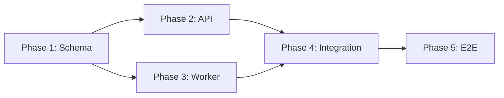

# Orchestration Mode

Read this only when the user asked for a plan that will be used to **orchestrate multiple agents in parallel** (or to delegate phases across different models). Otherwise, ignore this file — the plan stays sequential.

## Orchestration mindset

In sequential mode, phases are a timeline. In orchestration mode, phases are a **dependency graph**. The plan must answer:

- Which phases can run **in parallel**, and which must wait on others?
- What does each phase **publish** (outputs) and **consume** (inputs)?
- Where do parallel branches **merge**, and how is the merge validated?
- Which phases need a **stronger model** (high reasoning, tricky logic) and which can run on a faster/cheaper one?

If the plan does not answer these, an orchestrator cannot delegate it.

## Required additions to the plan

When in orchestration mode, the plan still uses the structure from `SKILL.md`, plus the additions below.

### A. Per-phase additions

In each phase block, add these fields after `Complexity`:

- **Parallel group.** A short label (e.g. `G1`, `G2-frontend`, `G2-backend`). Phases sharing a label can run concurrently. Phases in different groups have an order.
- **Depends on.** List of phase IDs this phase needs to consume outputs from. Use phase numbers; if there is no dependency, write `none`.
- **Suggested agent profile.** One of: `light` (deterministic, mechanical), `standard` (typical implementation work), `heavy` (architectural, tricky logic, ambiguous spec). This guides which model the orchestrator assigns. Be specific: say *why* it is heavy if it is heavy.

### B. New top-level section: §4 Orchestration

Add this after §3 (Execution guidance). It contains:

#### 4.1 Dependency graph

Show the phase graph. Two acceptable formats:

**Option A — adjacency list (preferred when there are ≤6 phases or the graph is mostly linear):**

```
Phase 1 → Phase 2, Phase 3
Phase 2 → Phase 4
Phase 3 → Phase 4
Phase 4 → Phase 5
```

**Option B — Mermaid (use when branching/merging is non-trivial and reading the list is harder than reading a picture):**



Pick one. Do not produce both for the same plan.

#### 4.2 Parallel groups

Tabulate which phases ship together:

| Group | Phases | Rationale |
|---|---|---|
| G1 | Phase 1 | Foundation; everything depends on it |
| G2 | Phase 2, Phase 3 | Independent — different files, no shared mutable state |
| G3 | Phase 4 | Merge point: integrates G2 outputs |
| G4 | Phase 5 | Final E2E validation |

#### 4.3 Inter-phase contracts

For each dependency edge in the graph, name the contract crossing it. This is what lets parallel phases proceed without coordinating constantly.

A contract is the smallest set of artifacts a downstream phase needs from an upstream one. Examples:

- "Phase 1 publishes the migration file `2026_xx_create_orders.sql` and the `Order` model with fields `[id, total, status]`. Phase 2 and Phase 3 consume from this surface only."
- "Phase 2 publishes the HTTP endpoint `POST /orders` returning `{ id, status }`. Phase 4 consumes this exact shape."

If a contract is fuzzy ("Phase 2 will probably expose something useful"), the parallelism is a lie — collapse the phases or sharpen the contract.

#### 4.4 Merge criteria

For every phase that joins two or more parallel branches, specify:

- What inputs it expects from each branch (by reference to §4.3).
- The integration validation — what proves the branches actually fit together. This is in addition to the phase's own §Validation.
- Conflict policy if branches produced incompatible outputs (rollback, re-plan, manual reconciliation).

#### 4.5 Orchestrator notes

A short prose section addressed to the orchestrating agent. Cover, when relevant:

- Which phases are safe to retry independently.
- Which phases must **not** be retried without human review (data migrations, destructive ops).
- Whether any phase needs a fresh agent context (avoid context pollution from earlier phases).
- Any phase whose output should be reviewed before downstream phases consume it.

## Heuristics for splitting and grouping

**Good candidates for parallelism:**

- Independent surface area (different modules, different files, no shared mutable state).
- Different layers that can be stubbed (e.g. backend behind a fixed contract, frontend against a mock).
- Test-writing alongside implementation, when the contract is settled.
- Documentation, fixtures, or seed data once shapes are frozen.

**Bad candidates for parallelism (keep sequential):**

- Phases that mutate the same files.
- Phases where one's output redefines the other's input (you'd be guessing the contract).
- Migrations and the code that depends on them — the migration must land first.
- Anything where the second phase's design depends on what the first phase *learns* during implementation.

If you find yourself inventing parallelism to hit a target group count, stop. A correct sequential plan beats a broken parallel one.

## Sanity checks before declaring the plan orchestration-ready

- [ ] The dependency graph has no cycles.
- [ ] Every parallel group's phases are genuinely independent (verify by asking: could two different agents work on these without talking to each other?).
- [ ] Every dependency edge has a named contract in §4.3.
- [ ] Every merge phase has explicit merge criteria in §4.4.
- [ ] Agent profile labels are justified, not sprinkled randomly.
- [ ] The plan still works if executed sequentially in topological order — orchestration is an optimization, not a requirement for correctness.
